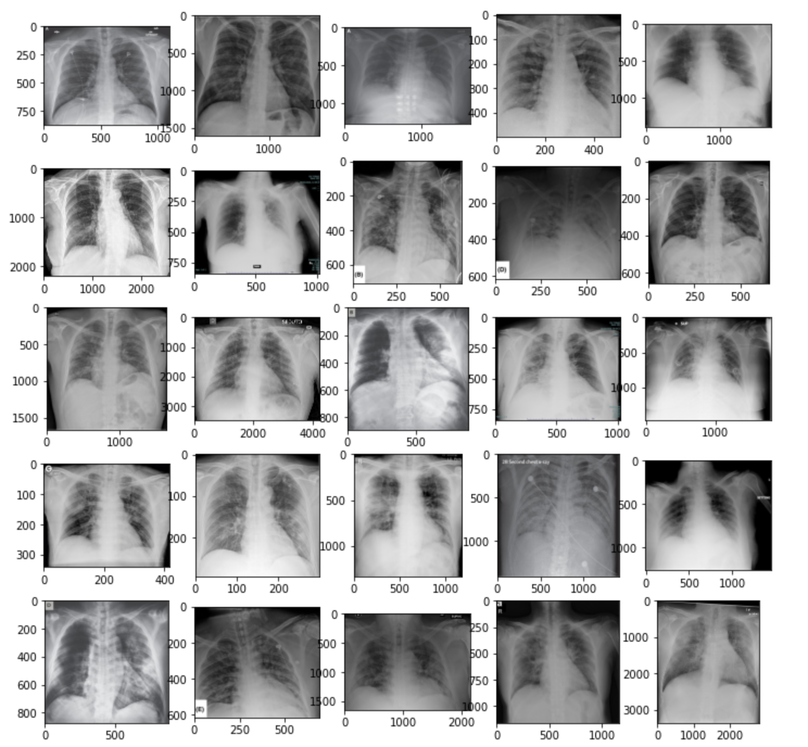
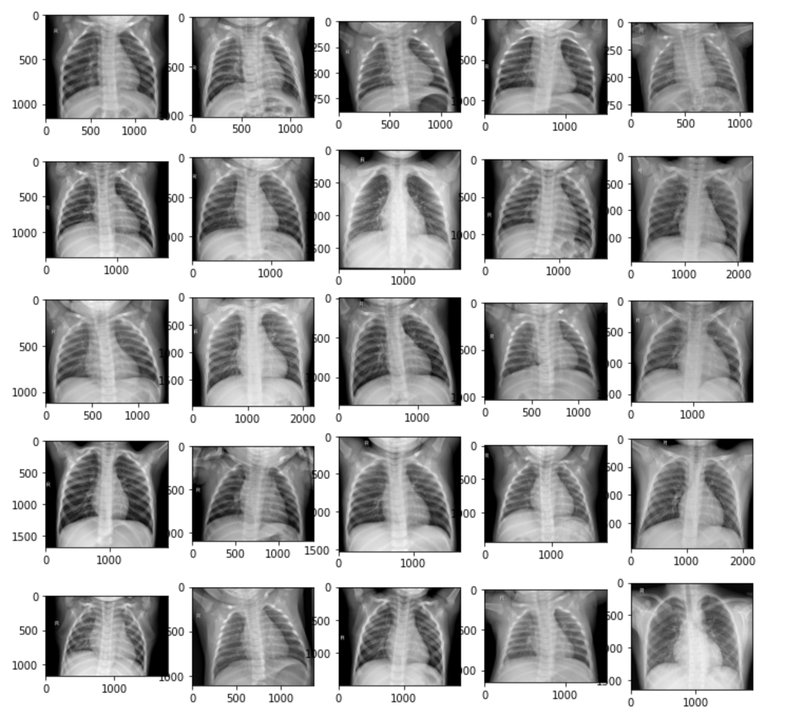
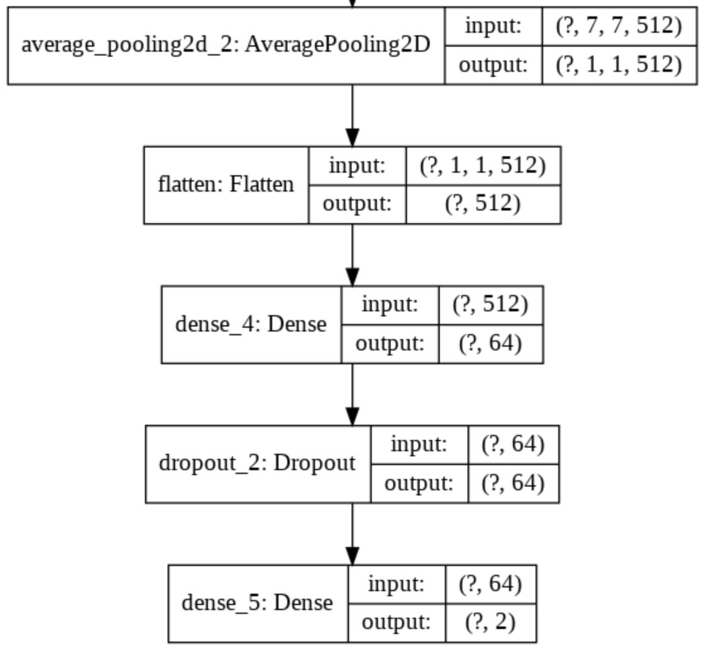
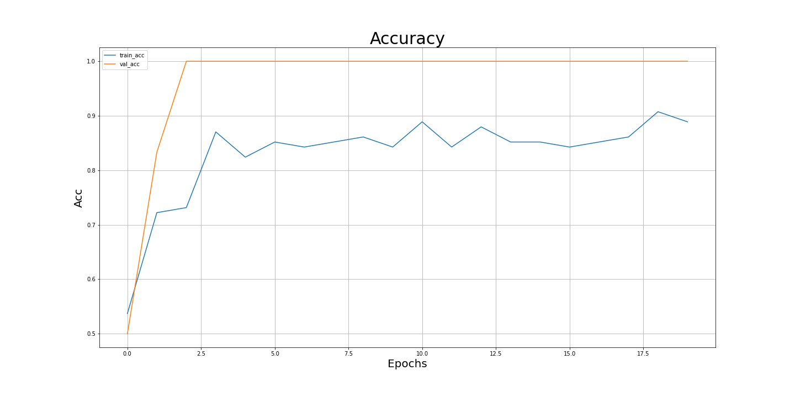
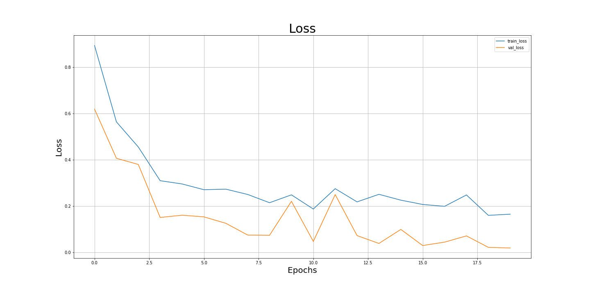

# Detecting COVID-19 in X-ray images

### Disclaimer

COVID-19 detection is only for educational purposes that don't mean highly accurate COVID-19 diagnosis system.

### Dataset

Positive samples come from <a href="https://github.com/ieee8023/covid-chestxray-dataset">this repo</a>.
And I used <a href="https://www.kaggle.com/paultimothymooney/chest-xray-pneumonia">Chest X-Ray Images (Pneumonia) dataset</a> for the samples of negative COVID-19.

<strong>Train</strong>

- Positives: 67 images
- Negatives: 67 images

20% of training samples were used for the validation set. 
<strong>Test</strong>

- Positives: 6 images
- Negatives: 6 images
   
  <i><strong>Positive samples</strong></i>
  
   
  <i><strong>Negative samples</strong></i>
  

As we can see here, the resolution and quality of images of each category are a bit different, but I just ignore that for the educational purpose. 

### Model

I grabbed VGG16 and added some layers, Avg_Pool2D, 2 Dense layers, and Dropout between the dense layers.
Then trained only layers added.

<strong>Added layers</strong>

### Result

As we can see here, it is underfitting on training data but the results on test data I got were 1.0 for Recall, Precision, and F1 score.

I can definitely say that the number of samples for test data is not enough, however, I could get a good result even small samples of training data with finetuning.
